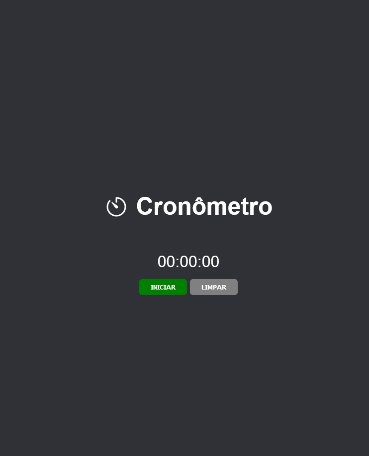

# Cronômetro Digital

> Status: concluido

Projeto para treinar as linguagens básicas - HTML,CSS e JavaScript

 - método: setInterval()
 - método: clearInterval()

Veja o projeto pronto: [>>click aqui<<](https://alancamposdev.github.io/cronometro/) 

---
Imagem do projeto

